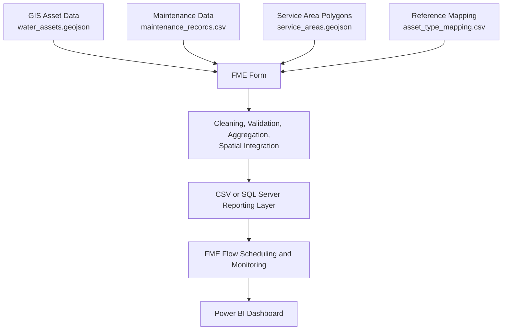

# Council Water Asset Maintenance Reporting Pipeline

This is a small, fictional, end-to-end data integration project for interview preparation. It simulates how a local council could integrate GIS water asset data with operational maintenance data, validate data quality, create a reporting layer, automate the process with FME Flow, and visualise the results in Power BI.

It is a realistic simulation only. It does not represent Rotorua Lakes Council's actual systems, data, or architecture.

## Business Scenario

A council manages public water infrastructure assets such as water pipes, hydrants, manholes, valves, and pumps. Spatial asset data is held in a GIS layer, while maintenance records and work-order costs are held in an operational system.

The goal is to integrate those sources into a clean asset-level reporting dataset that supports operational monitoring, asset management decisions, and Power BI dashboards.

## Architecture



## Project Structure

```text
council-gis-etl-project/
  README.md
  data/
    raw/
      water_assets.geojson
      maintenance_records.csv
      service_areas.geojson
    reference/
      asset_type_mapping.csv
    expected_output/
      asset_reporting_dataset.csv
      rejected_assets.csv
      unmatched_maintenance_records.csv
      data_quality_summary.csv
  sql/
    create_reporting_tables.sql
    validation_queries.sql
    reporting_queries.sql
  documentation/
    business_requirements.md
    data_dictionary.md
    data_quality_rules.md
    fme_form_build_guide.md
    fme_flow_deployment_guide.md
    power_bi_dashboard_plan.md
    test_cases.md
    interview_explanation.md
  scripts/
    generate_mock_data.py
    validate_output.py
```

## Datasets

- `water_assets.geojson`: fictional Rotorua-area assets with point and line geometries.
- `maintenance_records.csv`: fictional work-order records with cost, status, priority, and completion fields.
- `service_areas.geojson`: fictional Central, Western, Eastern, Northern, and Southern service-area polygons.
- `asset_type_mapping.csv`: maps inconsistent source asset type values to standard reporting categories.
- `asset_reporting_dataset.csv`: expected final reporting output at asset level.
- `rejected_assets.csv`: assets rejected because of critical data-quality failures.
- `unmatched_maintenance_records.csv`: maintenance records that reference assets missing from the cleaned asset dataset.
- `data_quality_summary.csv`: reconciliation and validation metrics.

## ETL Workflow

The intended FME Form workflow:

1. Read raw GIS assets, service areas, maintenance records, and reference mapping.
2. Trim text fields and standardise casing.
3. Map inconsistent source asset types to standard asset types.
4. Validate mandatory fields, dates, numeric values, conditions, statuses, and geometry.
5. Separate rejected asset records.
6. Join maintenance records to valid assets by `asset_id`.
7. Route unmatched work orders to an exception output.
8. Aggregate maintenance activity to asset level.
9. Assign each asset to a service area using spatial overlay.
10. Write reporting-ready CSV outputs or SQL Server tables.

## Data-Quality Issues Included

The mock source data intentionally includes a small number of issues:

- Duplicate and missing asset IDs
- Missing, invalid, and future install dates
- Missing and invalid condition values
- Inconsistent asset-type values
- Missing and invalid geometry
- Negative or text values in numeric fields
- Work orders referencing assets that do not exist
- Completion dates before maintenance dates
- Total cost reconciliation issues

Most records are valid so the dataset remains useful for reporting.

## FME Form

Use `documentation/fme_form_build_guide.md` to manually build the workspace. It explains the purpose and configuration of readers, writers, and transformers such as AttributeManager, AttributeTrimmer, StringCaseChanger, ValueMapper, Tester, DuplicateFilter, DateTimeConverter, GeometryValidator, FeatureJoiner, PointOnAreaOverlayer, StatisticsCalculator, Sorter, and Sampler.

## FME Flow

Use `documentation/fme_flow_deployment_guide.md` to explain how the completed FME Form workspace could be published, scheduled, monitored, and rerun in FME Flow. The scenario uses a nightly 2:00 am schedule.

Power BI refresh is a separate reporting step. FME Flow can prepare the files or SQL tables that Power BI reads, but Power BI Service refresh needs its own schedule, gateway, or API integration depending on the environment.

## SQL Server Option

The `sql` folder contains:

- `create_reporting_tables.sql`: table design, constraints, keys, and indexes.
- `validation_queries.sql`: checks for duplicates, missing fields, invalid dates, unmatched records, and cost issues.
- `reporting_queries.sql`: example reporting queries for common council questions.

## Power BI Dashboard

The planned one-page dashboard is `Council Water Asset Maintenance Overview`.

Recommended KPIs:

- Total Assets
- Assets in Poor or Critical Condition
- Total Maintenance Cost
- Open Work Orders
- Urgent Work Orders
- Average Asset Age

See `documentation/power_bi_dashboard_plan.md` for visuals, slicers, drill-through design, and DAX measures.

## How To Run The Python Scripts

From the project folder:

```powershell
python scripts/generate_mock_data.py
python scripts/validate_output.py
```

`generate_mock_data.py` uses only the Python standard library. `validate_output.py` uses pandas:

```powershell
pip install pandas
```

The generator uses a fixed random seed so the data can be regenerated consistently.

## Interview Preparation

Recommended order:

1. Read `business_requirements.md` to understand the scenario.
2. Inspect the raw and expected output files.
3. Run the generator and validator.
4. Read `data_quality_rules.md` and `test_cases.md`.
5. Walk through `fme_form_build_guide.md`.
6. Walk through `fme_flow_deployment_guide.md`.
7. Review SQL scripts and Power BI dashboard plan.
8. Practise the answers in `interview_explanation.md`.

The key message: this project shows practical ETL thinking, spatial awareness, data-quality handling, reporting design, and an honest learning approach to FME.

